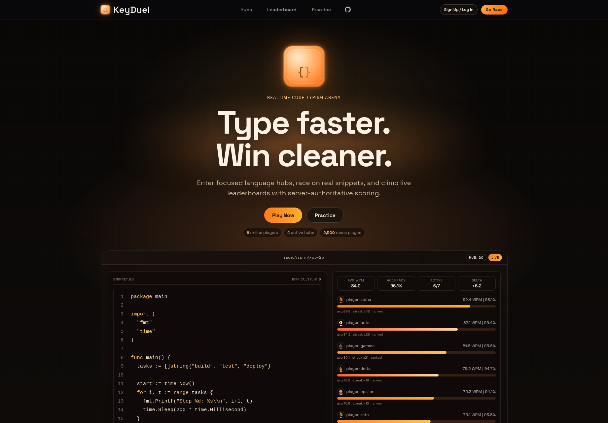

<p align="center">
  
</p>

<h1 align="center">KeyDuel</h1>

<p align="center">
  <strong>Realtime multiplayer code typing arena.</strong><br/>
  Enter language hubs, race on real code snippets, climb live leaderboards.
</p>

<p align="center">
  <a href="https://fsl.software/">
    
  </a>
  <a href="https://github.com/fj-onathan/keyduel">
    
  </a>
  <a href="https://github.com/fj-onathan/keyduel">
    
  </a>
  <a href="https://github.com/fj-onathan/keyduel/stargazers">
    
  </a>
</p>

<p align="center">
  <a href="https://keyduel.com"><strong>keyduel.com</strong></a> &middot;
  <a href="#how-it-works">How It Works</a> &middot;
  <a href="#architecture">Architecture</a> &middot;
  <a href="#quick-start">Quick Start</a> &middot;
  <a href="#tech-stack">Tech Stack</a> &middot;
  <a href="DEPLOY.md">Deploy</a>
</p>

<p align="center">
  
</p>

---

## Why KeyDuel

Generic typing tests measure raw speed on prose. Developers don't type prose — they type code. Code has brackets, semicolons, indentation, camelCase identifiers, and language-specific syntax that generic tests ignore.

KeyDuel is a competitive typing arena built specifically for code. Players enter language-specific hubs (Go, PHP, mixed), race head-to-head on real code snippets, and track progress on per-hub leaderboards with server-authoritative scoring.

---

## How It Works

```
1. Pick a Hub        Choose a language hub (Go, PHP, Mixed, ...)
2. Queue Up          Enter the matchmaking queue — matches fill in seconds
3. Race              Type a real code snippet against other players in realtime
4. Climb             Track WPM, accuracy, and wins on per-hub seasonal leaderboards
```

Every race is validated server-side. Input is checked for impossible progress jumps and macro-like behavior. Results are persisted to Postgres so profiles and leaderboards are always auditable.

---

## Architecture

KeyDuel is a monorepo with a React SPA frontend and three independent Go backend services communicating over WebSocket and HTTP.

```
┌─────────────────────────────────────────────────────────────────┐
│                        keyduel.com                              │
│                     React SPA (Nginx)                           │
└──────────┬──────────────────────────────────┬───────────────────┘
           │ HTTP                              │ WebSocket
           ▼                                  ▼
┌─────────────────────┐          ┌─────────────────────────┐
│   api.keyduel.com   │          │   ws.keyduel.com        │
│   Go API Server     │          │   Go Race Engine        │
│   (port 8080)       │          │   (port 8081)           │
│                     │          │                         │
│  - Auth (GitHub)    │          │  - WebSocket hub        │
│  - REST endpoints   │          │  - Room management      │
│  - Profile/stats    │          │  - Realtime broadcast   │
│  - Leaderboards     │          │  - Input validation     │
└────────┬────────────┘          └────────┬────────────────┘
         │                                │
         ▼                                ▼
┌─────────────────────────────────────────────────────────────────┐
│                    PostgreSQL 16 + Redis 7                       │
│            Users, Races, Leaderboards, Sessions                  │
└─────────────────────────────────────────────────────────────────┘
                                ▲
                                │ WebSocket
                      ┌─────────────────┐
                      │   Bot Runner    │
                      │  (background)   │
                      │  Fills races    │
                      │  with AI bots   │
                      └─────────────────┘
```

| Service | Role |
|---------|------|
| **Client** | React 19 SPA served by Nginx. Handles routing, UI, and WebSocket connections to the race engine. |
| **API** | REST server for auth, profiles, hubs, leaderboards, and platform stats. GitHub OAuth with Redis-backed sessions. |
| **Race Engine** | WebSocket server managing race rooms, matchmaking queues, realtime state broadcast (100ms tick), and input validation. |
| **Bot Runner** | Background process that connects to the race engine as AI players to fill races when human players are scarce. |

---

## Tech Stack

| Layer | Technology |
|-------|------------|
| Frontend | **React 19**, TypeScript 5.9, Vite 8, Zustand 5, Tailwind CSS 3 |
| Backend | **Go 1.25**, stdlib `net/http`, gorilla/websocket |
| Database | **PostgreSQL 16** (pgx/v5, pgxpool) |
| Cache & Sessions | **Redis 7** (go-redis/v9), cookie-based sessions |
| Auth | **GitHub OAuth** |
| Infrastructure | Docker, Docker Compose, Fly.io |
| Client Serving | Nginx 1.27 (SPA fallback, gzip, caching) |
| Migrations | golang-migrate v4.18.3 |

---

## Quick Start

### Prerequisites

- **Go** 1.25+ ([go.dev/dl](https://go.dev/dl/))
- **Node.js** 22+ ([nodejs.org](https://nodejs.org/))
- **Docker** and **Docker Compose** ([docker.com](https://www.docker.com/))

### Run Everything

```bash
git clone https://github.com/fj-onathan/keyduel.git
cd keyduel
cp .env.example .env        # edit GitHub OAuth values

make dev-up                  # starts Postgres, Redis, API, Race Engine, Bot Runner, Client
make migrate-up              # apply database migrations (first time)
make seed-snippets           # seed code snippets (first time)
```

The app is now running at `http://localhost:5173`.

### Run Services Individually

```bash
make infra-up                # start Postgres + Redis only
make server-api              # Go API server (requires local Go)
make server-race             # Go Race Engine (requires local Go)
make server-bot              # Go Bot Runner (requires local Go)
make client-dev              # React dev server (requires local Node)
```

### Useful Commands

```bash
make check                   # run lint + test + build (CI gate)
make lint                    # Go vet + ESLint
make test                    # Go tests
make build                   # Go compile + Vite build
make migrate-up              # apply pending migrations
make migrate-down            # roll back one migration
```

---

## Deployment

KeyDuel deploys to [Fly.io](https://fly.io) as four independent apps:

| App | What |
|-----|------|
| `keyduel-client` | Nginx serving the React SPA |
| `keyduel-api` | Go API server |
| `keyduel-race` | Go Race Engine (HTTP + WebSocket) |
| `keyduel-bot` | Go Bot Runner (background worker) |

See [DEPLOY.md](DEPLOY.md) for the full deployment guide covering Fly.io setup, database provisioning, secrets configuration, SSL, and migrations.

---

## Contributing

1. Fork the repository
2. Create a feature branch
3. Make your changes
4. Run `make check` (lint + test + build)
5. Submit a pull request

See [CONTRIBUTING.md](CONTRIBUTING.md) for detailed setup instructions.

---

## License

FSL-1.1-ALv2 — [Functional Source License](https://fsl.software/), converting to Apache 2.0 after two years. See [LICENSE](LICENSE) for details.
